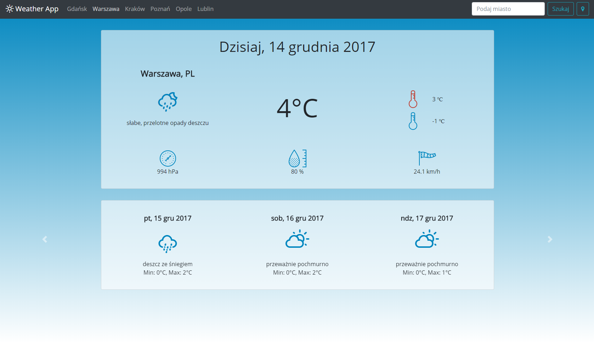

# weather-app

![License][license-url] ![Version][version-url] ![Done][done-url] ![Maintenance][maintenance-url]

#### Application that allows displaying current weather and its forecast for the current location or selected city. In order to learn, APIs from different suppliers were used.

The application is not completed, but is in development.

[license-url]: https://img.shields.io/badge/license-Apache%202-blue.svg?style=flat "License"
[version-url]: https://img.shields.io/badge/version-1.0.0-brightgreen.svg?style=flat "Version"
[done-url]: https://img.shields.io/badge/done-no-yellow.svg?style=flat "Done"
[maintenance-url]: https://img.shields.io/maintenance/no/2017.svg?style=flat "Maintenance"
